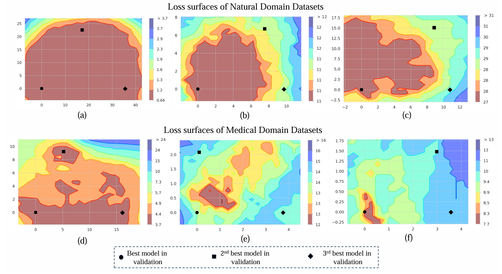
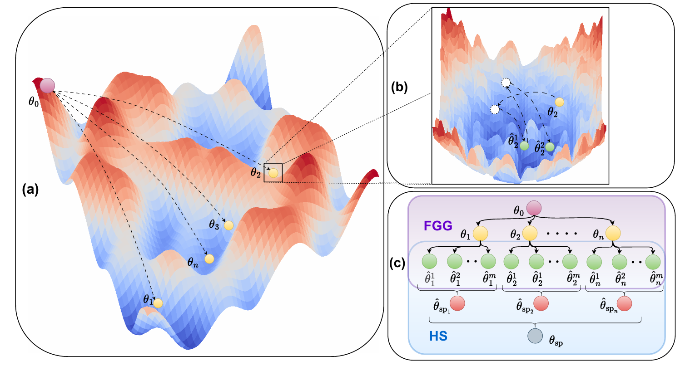

# FissionFusion: Fast Geometric Generation and Hierarchical Souping for Medical Image Analysis

**Authors**: 
[Santosh Sanjeev](https://github.com/santosh9sanjeev),
[Nuren Zhaksylyk](https://github.com/ZhNuren),
[Ibrahim Almakky](https://scholar.google.com/citations?user=T9MTcK0AAAAJ&hl=en&oi=sra),
[Anees Ur Rehman Hashmi](https://github.com/aneesurhashmi),
[Mohammad Areeb Qazi](https://scholar.google.com/citations?user=KeyK8FQAAAAJ&hl=en),
[Mohammad Yaqub](https://scholar.google.com/citations?user=9dfn5GkAAAAJ)


[](https://arxiv.org/abs/2403.13341)
[](https://mbzuaiac-my.sharepoint.com/:p:/g/personal/santosh_sanjeev_mbzuai_ac_ae/EecfRMTQnE9Kl1GfBnkpNPEBRK3nTGtSh8_egySSlt2Eug?e=3ogVQu)

---

> **Abstract:** The scarcity of well-annotated medical datasets requires leveraging transfer learning from broader datasets like ImageNet or pre-trained models like CLIP. Model soups averages multiple fine-tuned models aiming to improve performance on In-Domain (ID) tasks and enhance robustness against Out-of-Distribution (OOD) datasets. However, applying these methods to the medical imaging domain faces challenges and results in suboptimal performance. This is primarily due to differences in error surface characteristics that stem from data complexities such as heterogeneity, domain shift, class imbalance, and distributional shifts between training and testing phases. To address this issue, we propose a hierarchical merging approach that involves local and global aggregation of models at various levels based on models' hyperparameter configurations. Furthermore, to alleviate the need for training a large number of models in the hyperparameter search, we introduce a computationally efficient method using a cyclical learning rate scheduler to produce multiple models for aggregation in the weight space. Our method demonstrates significant improvements over the model souping approach across multiple datasets (around 6\% gain in HAM10000 and CheXpert datasets) while maintaining low computational costs for model generation and selection. Moreover, we achieve better results on OOD datasets than model soups.




## Contents

1) [Overview](#overview)
2) [Setup](#setup)
3) [Training Pipeline](#training)
4) [Inference](#inference)
4) [Datasets](#datasets)
6) [Citation](#citation)
7) [References](#references)
8) [Contact](#contact)

## Overview

Welcome to the repository for "FissionFusion: Fast Geometric Generation and Hierarchical Souping for Medical Image Analysis". This paper introduces the limitations of model soups and introduces an innovative approach towards generation and merging of models. 



---
## Setup

1. Clone the repository:
    ```bash
    git clone https://github.com/BioMedIA-MBZUAI/Fission-Fusion.git
    ```

2. Create a conda environment:

    ```bash
    conda create --name fissionfusion python=3.8
    conda activate fissionfusion
    ```

3. Install PyTorch and other dependencies:

    ```bash
    pip install -r requirements.txt
    ```
---

## Datasets
Details about the datasets currently supported, data directory structure for the datasets is available [here](datasets.md)

---

## Training 

1. ### Grid Search Experiments:
    a) To run the grid search experiments, we need to run the linear probing first as a warmup to get the linear-probed model (θ<sub>lp</sub>). Please change the DATASETS paths, and the implementation section in the corresponding config file as per the dataset and model. 
       
    ```bash
    python train.py --config './configs/lp.yaml'
    ```

    b) To run the finetuning stage (which returns 48 models for all the hyperparameter settings)
       
    ```bash
    python finetune.py --config './configs/full_finetuning.yaml'
    ```

2. ### Fast Geometric Generation: 
    a) For the fast geometric generation experiments, we first get the models for different learning rates fixing the seed = 1 and augmentation = Heavy. We get 6 models for each learning rate including the initial model.
       
    ```bash
    python finetune.py --config './configs/pre_fgg_finetuning.yaml'
    ```

    b) To further generate the models in the second stage, we use a cyclic learning rate scheduler and save models for every cycle.

    ```bash
    python fgg.py --config './configs/fgg.yaml'
    ```
---

## Inference
1. ### Model Soups (Uniform and Greedy Soups):
    a) To run uniform and greedy soups on the Grid Search (GS) generated models, execute

    ```bash
    python gs_model_souping_test.py --config './configs/gs_model_souping_test.yaml'
    ```

    b) To run uniform and greedy soups on the FGG generated models, execute

    ```bash
    python fgg_model_souping_test.py --config './configs/fgg_model_souping_test.yaml'
    ```

    c) To test the Hierarchical Souping (HS) approach, run

    ```bash
    python hierarchical_souping.py --config './configs/hierarchical_souping.yaml'
    ```


---
## Citation

If you use **Fission-Fusion** or our repository in your research, please cite our paper *FissionFusion: Fast Geometric Generation and Hierarchical Souping for Medical Image Analysis
*:

```
@misc{sanjeev2024fissionfusion,
      title={FissionFusion: Fast Geometric Generation and Hierarchical Souping for Medical Image Analysis}, 
      author={Santosh Sanjeev and Nuren Zhaksylyk and Ibrahim Almakky and Anees Ur Rehman Hashmi and Mohammad Areeb Qazi and Mohammad Yaqub},
      year={2024},
      eprint={2403.13341},
      archivePrefix={arXiv},
      primaryClass={cs.CV}
}
```
---
## References
Our work is based on

- [Model Soups](https://proceedings.mlr.press/v162/wortsman22a/wortsman22a.pdf)
- [DNN Mode Connectivity](https://arxiv.org/abs/1802.10026)

---
## Contact

For any inquiries or questions, please create an issue on this repository or contact Santosh Sanjeev at santosh.sanjeev@mbzuai.ac.ae.

---

